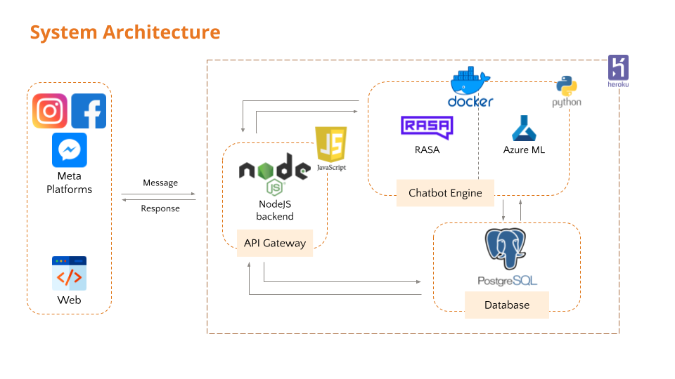

<h1 align="center">Capstone Chatbot</h1>

### Introduction
A chatbot hosted on Facebook that approaches customers with interactive features that encourages engagement between the brand and customers through providing assistance to customers’ queries and promoting awareness of the benefits of insurance, thereby leaving a memorable brand image on customers.

This is the README.md file for our [Facebook Messenger](https://developers.facebook.com/docs/messenger-platform/) component.

## Table of Contents
- [Table of Contents](#table-of-contents)
- [1. Tech Stack](#1-tech-stack)
- [2. Project Files Description](#2-project-files-description)
  - [Folder Structure](#folder-structure)
- [3. Installation & Configuration](#3-installation--configuration)
  - [Prerequisites](#prerequisites)
  - [Installation](#installation)
  - [Facebook chatbot configuration](#facebook-chatbot-configuration)
- [4. Usage](#4-usage)
- [5. Deployment](#5-deployment)
  - [Push changes to Heroku](#push-changes-to-heroku)
  - [Make requests to Rasa](#make-requests-to-rasa)
- [6. Local Testing](#6-local-testing)
  - [To start webhook on localhost, run:](#to-start-webhook-on-localhost-run)

## 1. Tech Stack
Here's a brief high-level overview of the tech stack:



## 2. Project Files Description
### Folder Structure
    .
    ├── index.js              Main file handling the app
    ├── hooks.js              
    ├── package.json          Keep track of the project's dependencies, scripts and versioning
    ├── package-lock.json     Keep track of the exact version of every package that is installed
    ├── .sample.env           Sample of .env file
    ├── index.js
    ├── .gitignore            Specifies intentionally untracked files that Git should ignore
    ├── server.sh
    ├── Procfile              Commands used to deploy
    ├── images                Images used in README.md
    └── README.md             Provides overview of the repository

## 3. Installation & Configuration

### Prerequisites
- [Node](https://nodejs.org/en/) installed
- [Facebook developers account](https://developers.facebook.com/)

### Installation
To clone the repository, install [git](https://git-scm.com/downloads) and run:
```bash
git clone x
```
Change directory into the repository:
```bash
cd salesbot
```
Install the Node packages:
```bash
npm install
```

### Facebook chatbot configuration
Create and setup a Facebook application using [Quick Start Guide](https://developers.facebook.com/docs/messenger-platform/getting-started/quick-start) and find out access token and app secret.

## 4. Usage
Set up .env by copying the file `.sample.env` to `.env`

```bash
cp .sample.env .env
```

Edit the `.env` file to add all the values for your app and page. Note that APP_URL will be the external URL from step 1.

Running the app locally:
```bash
node index.js
```
You should be able to access the application in your browser at [http://localhost:3000](http://localhost:3000).

## 5. Deployment
### Push changes to Heroku
Install [Heroku CLI](https://devcenter.heroku.com/articles/heroku-cli#download-and-install).
Log in to Heroku using the Heroku CLI. 
```
heroku login
```
> Please note that you need to be a collaborator in the heroku app.

Use Git to clone salesbot-messenger's source code to your local machine.
```
heroku git:clone -a salesbot-messenger
cd salesbot-messenger
```
You can now make changes to the RASA NLU by pushing the changes.
```
git add .
git commit -am "comments"
git push heroku master
```
Heroku will automatically handle the changes, re-build NLU model and re-start the server.
> Please note that locally trained NLU models won't be pushed to the Heroku repository.

### Make requests to Rasa
Once your server is deployed, you can make requests to your NLU model via [Rasa HTTP API](https://rasa.com/docs/rasa/api/http-api/#operation/parseModelMessage)
For example:
```
curl https://<your Heroku application name>.herokuapp.com/model/parse -d '{"text":"hello"}'
```

## 6. Local Testing

### To start webhook on localhost, run:

    $ node index.js

Send cURL to test webhook verification:

    curl -X GET "localhost:1337/webhook?hub.verify_token=<YOUR_VERIFY_TOKEN>&hub.challenge=CHALLENGE_ACCEPTED&hub.mode=subscribe"

    curl -X GET "https://sales-bot-webhooks.herokuapp.com/webhook?hub.verify_token=<YOUR_VERIFY_TOKEN>&hub.challenge=CHALLENGE_ACCEPTED&hub.mode=subscribe"

Send cURL to test webhook:

    curl -H "Content-Type: application/json" -X POST "localhost:1337/webhook" -d '{"object": "page", "entry": [{"messaging": [{"message": "TEST_MESSAGE"}]}]}'

    curl -H "Content-Type: application/json" -X POST "https://sales-bot-webhooks.herokuapp.com/webhook" -d '{"object": "page", "entry": [{"messaging": [{"message": "TEST_MESSAGE"}]}]}'